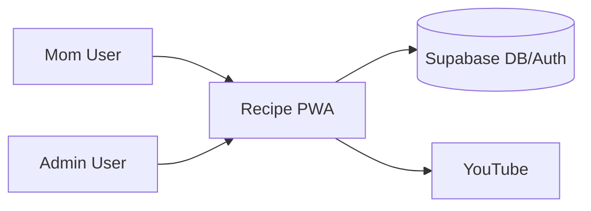
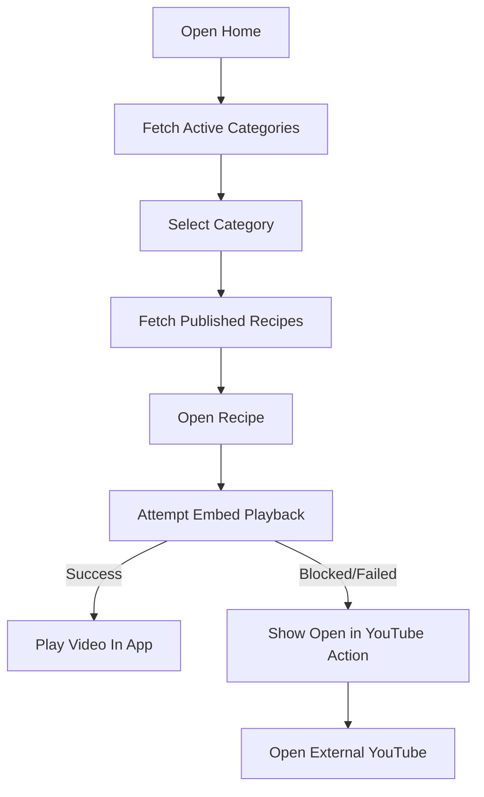
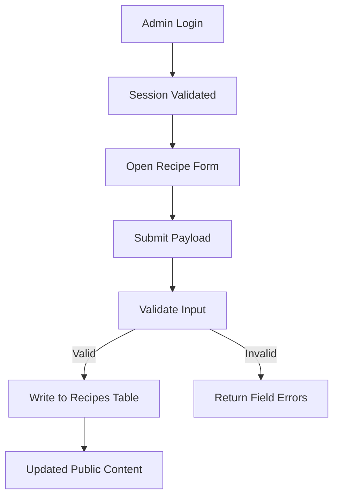
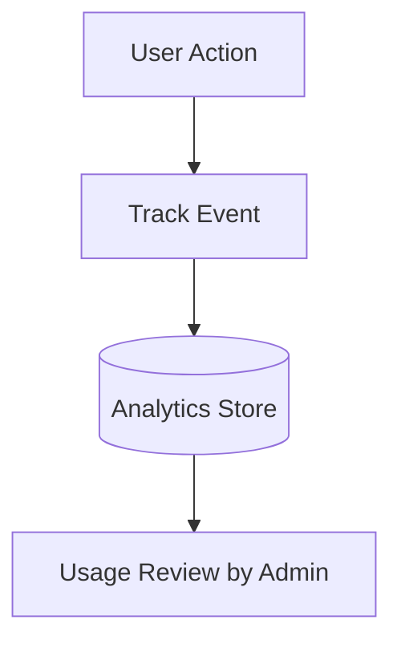

# DFD: User and Admin Data Flows

## Context Diagram

```mermaid
flowchart LR
    Mom[Mom User] --> App[Recipe PWA]
    Admin[Admin User] --> App
    App --> Supabase[(Supabase DB/Auth)]
    App --> YouTube[YouTube]
```

## Public Flow (Browse and Play)

```mermaid
flowchart TD
    A[Open Home] --> B[Fetch Active Categories]
    B --> C[Select Category]
    C --> D[Fetch Published Recipes]
    D --> E[Open Recipe]
    E --> F[Attempt Embed Playback]
    F -->|Success| G[Play Video In App]
    F -->|Blocked/Failed| H[Show Open in YouTube Action]
    H --> I[Open External YouTube]
```

## Admin Flow (CRUD)

```mermaid
flowchart TD
    A1[Admin Login] --> B1[Session Validated]
    B1 --> C1[Open Recipe Form]
    C1 --> D1[Submit Payload]
    D1 --> E1[Validate Input]
    E1 -->|Valid| F1[Write to Recipes Table]
    E1 -->|Invalid| G1[Return Field Errors]
    F1 --> H1[Updated Public Content]
```

## Analytics Flow

```mermaid
flowchart TD
    U[User Action] --> T[Track Event]
    T --> S[(Analytics Store)]
    S --> R[Usage Review by Admin]
```
