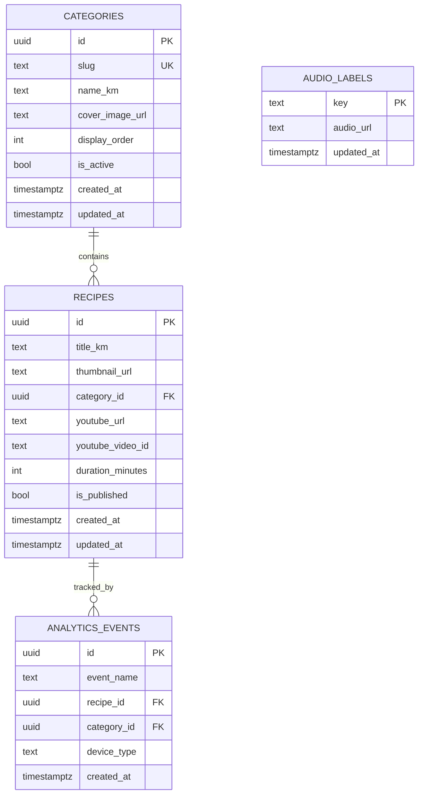

# ERD: Core Data Model

## Mermaid ER Diagram

## Table Details

### `categories`

- Purpose: Recipe grouping for visual navigation
- Constraints:
  - `slug` unique
  - `display_order` sortable
  - inactive categories hidden on public UI

### `recipes`

- Purpose: Public recipe catalog and playback metadata
- Constraints:
  - `title_km`, `thumbnail_url`, `youtube_url`, `category_id` required
  - `youtube_video_id` derived from `youtube_url`
  - `is_published = false` hides recipe publicly
- Indexes:
  - `(category_id, is_published)`
  - `youtube_video_id`

### `audio_labels`

- Purpose: recorded Khmer fallback audio for key UI actions
- Keys example:
  - `open_video`
  - `back_home`
  - `network_error`

### `analytics_events` (optional lightweight internal tracking)

- Purpose: privacy-safe usage stats for improvement
- Event examples:
  - `category_opened`
  - `recipe_opened`
  - `video_play_attempted`
